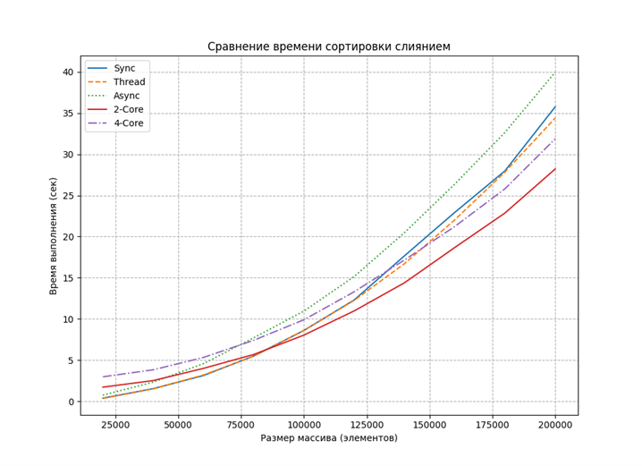
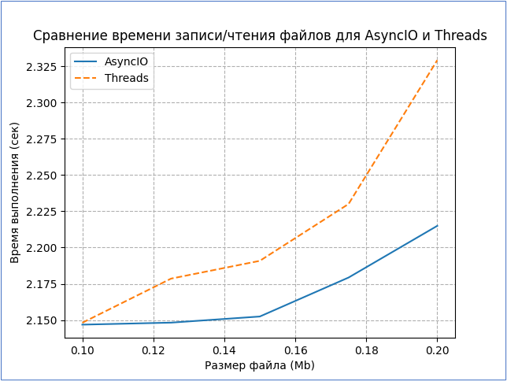

# Реализация для CPU-Bound модели
В качестве CPU Bound задачи выбрана задача по сортировке методом слияния большого массива целочисленных числовых данных. Сортировка слиянием базируется на разделении сортируемого массива на части, в которых сортировка производится независимо, поэтому в этом алгоритме возможно применение асинхронных моделей вычислений.  Очевидно, что данная задача интенсивно использует ресурсы CPU, при этом операции ввода-вывода (I/O) в ней полностью отсутствуют. 
Реализованы следующие модели вычислений:
- **(Sync)** Синхронная модель с одним потоком выполнения
- **(Thread)** Модель с 4-мя потоками выполнения в рамках интерпретатора с ограничением GIL
- **(Async)** Асинхронная корутинная модель (asyncio) с 1-им потоком выполнения с ограничением GIL
- **(2-Core)** Модель с параллельным выполнением с использованием двух процессоров  
- **(4-Core)** Модель с параллельным выполнением с использованием четырех процессоров

### mergesort_test.py
```python
import time
from concurrent.futures import ThreadPoolExecutor
from contextlib import contextmanager
from multiprocessing import Manager, Pool
import matplotlib.pyplot as plt
import asyncio


class Timer:
    """
    Класс для подсчета длительности вычислительных операций
    """
    def __init__(self, *steps):
        """
        Конструктор класса
        :param steps: Имена шагов (ключи словаря), для записи и чтения данных по длительности
        """
        self._time_per_step = dict.fromkeys(steps)

    def __getitem__(self, item):
        """
        Магический метод получения значения по ключу
        :param item: значение ключа (имя шага измерения)
        :return: значение из словаря (длительность операции)
        """
        return self.time_per_step[item]

    @property
    def time_per_step(self):
        """
        Свойство для чтения элементов словаря
        :return: значение длительности операции
        """
        return {
            step: elapsed_time
            for step, elapsed_time in self._time_per_step.items()
            if elapsed_time is not None and elapsed_time > 0
        }

    def start_for(self, step):
        """
        Запуск таймера для определенного шага
        :param step: шаг
        :return: None
        """
        self._time_per_step[step] = -time.time()

    def stop_for(self, step):
        """
        Остановка таймера для определенного шага
        :param step: шаг
        :return: None
        """
        self._time_per_step[step] += time.time()


def merge_sort_multiple(results, array):
    """
    Функция сортировки для многопроцессорной обработки
    :param results: массив для агрегирования результатов
    :param array: сортируемый массив
    :return: None
    """
    results.append(merge_sort(array))


def merge_multiple(results, array_part_left, array_part_right):
    """
    Функция слияния результатов для многопроцессорной обработки
    :param results: массив для агрегирования результатов
    :param array_part_left: левый массив для слияния
    :param array_part_right: правый массив для слияния
    :return: None
    """
    results.append(merge(array_part_left, array_part_right))


def merge_sort(array):
    """
    Функция сортировки для одного потока выполнения
    :param array: сортируемый массив
    :return: отсортированный массив
    """
    array_length = len(array)

    if array_length <= 1:
        return array

    middle_index = int(array_length / 2)
    left = array[0:middle_index]
    right = array[middle_index:]
    left = merge_sort(left)
    right = merge_sort(right)
    return merge(left, right)

def thread_merge_sort(array, level = 0):
    """
    Функция сортировки для многопотоковой обработки
    :param array: сортируемый массив
    :param level: глубина сортировки, начиная с которой вызывается однопоточная сортировка.
    До этого уровня вызывается многопоточная
    :return: отсортированный массив
    """
    level += 1
    array_length = len(array)
    if array_length <= 1:
        return array

    middle_index = int(array_length / 2)
    left = array[0:middle_index]
    right = array[middle_index:]
    with ThreadPoolExecutor() as executor:
        if level > 1:
            future1 = executor.submit(thread_merge_sort, (left, level, ))
            future2 = executor.submit(thread_merge_sort, (right, level, ))
        else:
            future1 = executor.submit(merge_sort, left)
            future2 = executor.submit(merge_sort, right )
        left = future1.result()
        right = future2.result()
    return merge(left, right)

async def async_merge_sort(array):
    """
    Функция сортировки для корутинной (asyncio) обработки
    :param array: сортируемый массив
    :return: отсортированный массив
    """
    array_length = len(array)
    if array_length <= 1:
        return array

    middle_index = int(array_length / 2)
    left = array[0:middle_index]
    right = array[middle_index:]
    task_left = async_merge_sort(left)
    task_right = async_merge_sort(right)
    # left = await async_merge_sort(left)
    # right = await async_merge_sort(right)
    left, right = await asyncio.gather(task_left, task_right)
    return merge(left, right)

def merge(left, right):
    """
    Функция однопоточного слияния двух массивов
    :param left: левый массив
    :param right: правый массив
    :return: массив после слияния правой и левой частей
    """
    sorted_list = []
    # Создаем копии, чтобы не изменять
    # оригинальные объекты.
    left = left[:]
    right = right[:]
    # На самом деле не нужно проверять длину списков,
    # так как истинность пустых списков равна False.
    # Это сделано для демонстрации алгоритма.
    while len(left) > 0 or len(right) > 0:
        if len(left) > 0 and len(right) > 0:
            if left[0] <= right[0]:
                sorted_list.append(left.pop(0))
            else:
                sorted_list.append(right.pop(0))
        elif len(left) > 0:
            sorted_list.append(left.pop(0))
        elif len(right) > 0:
            sorted_list.append(right.pop(0))
    return sorted_list

@contextmanager
def process_pool(size):
    """
    Создаем пул процессов и блокируем его до тех пор, пока все процессы не завершатся.
    :param size: размер пула
    :return: None
    """
    pool = Pool(size)
    yield pool
    pool.close()
    pool.join()

def parallel_merge_sort(array, process_count):
    """
    Основная функция многопроцессорной сортировки
    :param array: сортируемый массив
    :param process_count: количество процессоров, задействованных в сортировке
    :return: отсортированный массив
    """
    # Делим список на части
    step = int(length / process_count)

    # Используется объект multiprocessing.Manager, для хранения вывода каждого процесса.
    # Пример здесь:
    # http://docs.python.org/library/multiprocessing.html#sharing-state-between-processes
    manager = Manager()
    results = manager.list()

    with process_pool(size=process_count) as pool:
        for n in range(process_count):
            # Создаем новый объект Process и присваиваем ему
            # значение, возвращаемое функцией merge_sort_multiple,
            # использую подсписок, как входное значение
            if n < process_count - 1:
                chunk = array[n * step : (n + 1) * step]
            else:
                # Оставшиеся элементы - в список
                chunk = array[n * step:]
            pool.apply_async(merge_sort_multiple, (results, chunk))

    # Слияние:
    # При количестве ядер больше 2 мы можем использовать мультипроцессинг
    # для параллельного слияния подсписков.
    while len(results) > 1:
        with process_pool(size=process_count) as pool:
            pool.apply_async(
                merge_multiple,
                (results, results.pop(0), results.pop(0))
            )

    final_sorted_list = results[0]

    return final_sorted_list


if __name__ == '__main__':
    # Подготовка данных для графического отображения
    x  = []
    y1 = []
    y2 = []
    y3 = []
    y4 = []
    y5 = []
    for length in range(20000, 200001, 20000):
        x.append(length)
        print('-- Размер сортируемого массива - {:,}'.format(length).replace(',',' '))

        main_timer = Timer('sync', 'thread', 'async', '2_core', '4_core')

        # Создание разреженного массива для более интенсивной сортировки
        unsorted_array = [i if i % 2 else length - i for i in range(length, 0, -1)]
        # Создаение отсортированной копии для сравнения
        sorted_array_etalon = unsorted_array[:]
        sorted_array_etalon.sort()

        # Сортировка

        # Запуск синхронной сортировки
        main_timer.start_for('sync')
        sorted_array = merge_sort(unsorted_array)
        main_timer.stop_for('sync')
        # Сравнение с эталонным массовом для проверки правильности реализации.
        if sorted_array_etalon == sorted_array:
            print('Время синхронной сортировки: %4.6f sec' % main_timer['sync'])
        else:
            print('SyncSort: Отсортированный массив не совпадает с эталонным')
            break

        # Запуск потоковой сортировки
        main_timer.start_for('thread')
        sorted_array = thread_merge_sort(unsorted_array)
        main_timer.stop_for('thread')
        if sorted_array_etalon == sorted_array:
            print('Время потоковой сортировки: %4.6f sec' % main_timer['thread'])
        else:
            print('ThreadSort: Отсортированный массив не совпадает с эталонным')
            break

        # Запуск корутинной сортировки
        main_timer.start_for('async')
        sorted_array = asyncio.run(async_merge_sort(unsorted_array))
        main_timer.stop_for('async')
        if sorted_array_etalon == sorted_array:
            print('Время корутинной сортировки: %4.6f sec' % main_timer['async'])
        else:
            print('AsyncSort: Отсортированный массив не совпадает с эталонным')
            break

        # Запуск 2-х процессорной сортировки
        main_timer.start_for('2_core')
        sorted_array = parallel_merge_sort(unsorted_array, 2)
        main_timer.stop_for('2_core')
        if sorted_array_etalon == sorted_array:
            print('Время 2-х процессорной сортировки: %4.6f sec' % main_timer['2_core'])
        else:
            print('2-CoreSort: Отсортированный массив не совпадает с эталонным')
            break

        # Запуск 4-х процессорной сортировки
        main_timer.start_for('4_core')
        sorted_array = parallel_merge_sort(unsorted_array, 4)
        main_timer.stop_for('4_core')
        if sorted_array_etalon == sorted_array:
            print('Время 4-х процессорной сортировки: %4.6f sec' % main_timer['4_core'])
        else:
            print('4-CoreSort: Отсортированный массив не совпадает с эталонным')
            break

        # Сохранение графических результатов
        y1.append((main_timer['sync']))
        y2.append((main_timer['thread']))
        y3.append((main_timer['async']))
        y4.append((main_timer['2_core']))
        y5.append((main_timer['4_core']))

    # Вывод графических результатов
    plt.title('Сравнение времени сортировки слиянием')
    plt.xlabel('Размер массива (элементов)')
    plt.ylabel('Время выполнения (сек)')
    plt.plot(x, y1, label='Sync', linestyle='solid')
    plt.plot(x, y2, label='Thread', linestyle='dashed')
    plt.plot(x, y3, label='Async', linestyle='dotted')
    plt.plot(x, y4, label='2-Core', linestyle='solid')
    plt.plot(x, y5, label='4-Core', linestyle='dashdot')
    plt.legend()
    plt.grid(True, which='both', linestyle='--')
    plt.show()
```
### Результат выполнения
```text
-- Размер сортируемого массива - 20 000
Время синхронной сортировки: 0.374032 sec
Время потоковой сортировки: 0.342080 sec
Время корутинной сортировки: 0.741008 sec
Время 2-х процессорной сортировки: 1.709895 sec
Время 4-х процессорной сортировки: 2.968927 sec
-- Размер сортируемого массива - 40 000
Время синхронной сортировки: 1.528718 sec
Время потоковой сортировки: 1.502340 sec
Время корутинной сортировки: 2.314480 sec
Время 2-х процессорной сортировки: 2.509417 sec
Время 4-х процессорной сортировки: 3.817746 sec
-- Размер сортируемого массива - 60 000
Время синхронной сортировки: 3.119643 sec
Время потоковой сортировки: 3.186625 sec
Время корутинной сортировки: 4.565324 sec
Время 2-х процессорной сортировки: 3.990719 sec
Время 4-х процессорной сортировки: 5.314322 sec
-- Размер сортируемого массива - 80 000
Время синхронной сортировки: 5.489999 sec
Время потоковой сортировки: 5.455169 sec
Время корутинной сортировки: 7.704425 sec
Время 2-х процессорной сортировки: 5.677315 sec
Время 4-х процессорной сортировки: 7.400623 sec
-- Размер сортируемого массива - 100 000
Время синхронной сортировки: 8.597562 sec
Время потоковой сортировки: 8.603898 sec
Время корутинной сортировки: 10.952973 sec
Время 2-х процессорной сортировки: 8.033328 sec
Время 4-х процессорной сортировки: 9.895617 sec
-- Размер сортируемого массива - 120 000
Время синхронной сортировки: 12.298032 sec
Время потоковой сортировки: 12.246438 sec
Время корутинной сортировки: 15.144410 sec
Время 2-х процессорной сортировки: 10.972217 sec
Время 4-х процессорной сортировки: 13.297193 sec
-- Размер сортируемого массива - 140 000
Время синхронной сортировки: 17.658128 sec
Время потоковой сортировки: 16.704599 sec
Время корутинной сортировки: 20.472919 sec
Время 2-х процессорной сортировки: 14.383353 sec
Время 4-х процессорной сортировки: 17.154512 sec
-- Размер сортируемого массива - 160 000
Время синхронной сортировки: 22.929230 sec
Время потоковой сортировки: 22.022332 sec
Время корутинной сортировки: 26.366751 sec
Время 2-х процессорной сортировки: 18.666335 sec
Время 4-х процессорной сортировки: 21.217738 sec
-- Размер сортируемого массива - 180 000
Время синхронной сортировки: 27.980751 sec
Время потоковой сортировки: 27.833588 sec
Время корутинной сортировки: 32.642512 sec
Время 2-х процессорной сортировки: 22.859973 sec
Время 4-х процессорной сортировки: 25.802247 sec
-- Размер сортируемого массива - 200 000
Время синхронной сортировки: 35.756253 sec
Время потоковой сортировки: 34.395561 sec
Время корутинной сортировки: 39.964155 sec
Время 2-х процессорной сортировки: 28.207959 sec
Время 4-х процессорной сортировки: 31.876171 sec
```

## Выводы
Из диаграммы сравнительных результатов можно сделать следующие выводы:
1.	На малых размерах сортируемого массива наиболее оптимальной моделью решения задачи сортировки является синхронная однопоточная модель (Sync), так как на всех остальных моделях переключение контекста выполнения с потока на поток вносит задержки, соизмеримые со временем выполнения основного алгоритма
2.	На больших размерах сортируемого массива наиболее оптимальная модель выполнения алгоритма сортировки – параллельное выполнение на 2-х CPU (2-Core). Увеличение количества используемых процессоров до 4-х (4-Core) увеличивает время выполнения, так как время на переключения контекста выполнения растет быстрее, чем уменьшение времени вычисления от распараллеливания
3.	Время синхронного выполнения сортировки (Sync) и выполнение сортировки в 4-х потоках (Thread) примерно одинаковы, так как уменьшение времени от применения многопоточности компенсируется увеличением времени на переключения контекста между потоками   
4.	Наихудшие результаты для CPU-Bound задач дает корутинная модель (Async). Это связано с тем, что данная модель работает в одном потоке с глобальной блокировкой GIL, что хуже, чем синхронная работа в одном потоке 

# Реализация для IO-Bound модели
В качестве задачи для сравнения производительности моделей Thread и AsyncIO создан алгоритм с интенсивным файловым обменом:
- Созданы два класса: **AsyncTester** и **ThreadTester** соответственно для асинхронной и потоковой модели, в которых реализованы функции записи в файл и чтения из файла. Так же создана функция run для каждого из классов, которая выполняет само тестирование
- При тестировании на первом шаге создаются 10 текстовых файлов. После этого в случайном порядке программа производит 100 чтений из каждого файла, моделируя при этом задержки (от 0 до 2 секунд), характерные для интернет-соединений
- Тесты повторяются 4 раза для разных размеров файлов в диапазоне от 100Кб до 200Кб   
- При этом на каждом тесте фиксируется задействованное количество потоков 
### filewrite_classes.py
```python
import asyncio
import random
import threading
import time
import aiofiles
from async_class import AsyncClass
from collections import namedtuple


TestResult = namedtuple('TestResult', ['file_size', 'elapsed_time', 'threads_count'])

class AsyncTester(AsyncClass):
    async def __ainit__(self, files_count, file_size):
        """
        Конструктор класса
        :param files_count: количество файлов для тестирования
        :param file_size: размер каждого файлов в байтах
        :return: класс
        """
        self.files_count = files_count
        self.file_size = file_size

    async def run(self):
        """
        Функция асинхронного тестирования
        :return: результаты тестирования в виде именованного кортежа
        """
        write_tasks = []
        read_tasks = []
        start_time = time.time()
        for i in range(self.files_count):
            write_tasks.append(self.writter(f'{i}.txt'))
        for i in range(self.files_count * 100):
            read_tasks.append(self.reader(self.files_count))
        threads_count = threading.active_count()
        await asyncio.gather(*write_tasks)
        await asyncio.gather(*read_tasks)
        return TestResult(self.file_size, (time.time() - start_time), threads_count)

    async def writter(self, filename):
        """
        Функция записи в файл
        :param filename: имя файла
        :return: None
        """
        async with aiofiles.open(filename, mode='w') as file:
            content = ''.join([str(num) for num in range(self.file_size)])
            await file.write(content)

    async def reader(self, files_count):
        """
        Функция чтения из случайного файла в пределах предварительно созданных
        :param files_count: количество файлов
        :return: None
        """
        i = random.randint(0, files_count - 1)
        async with aiofiles.open(f'{i}.txt', mode='r') as file:
            await asyncio.sleep(random.uniform(0, 2))
            await file.read()


class ThreadTester:
    def __init__(self, files_count, file_size):
        """
        Конструктор класса
        :param files_count: количество файлов
        :param file_size: размер каждого файла в байтах
        """
        self.files_count = files_count
        self.file_size = file_size

    def run(self):
        """
        Функция потокового тестирования
        :return: результаты тестирования в виде именованного кортежа
        """
        write_threads = []
        read_threads = []
        start_time = time.time()
        # write files
        for i in range(self.files_count):
            thread = threading.Thread(target=self.writter, args=[i])
            thread.start()
            write_threads.append(thread)
        threads_count = threading.active_count()
        # read files with sleep
        for thread in write_threads:
            thread.join()
        for i in range(self.files_count * 100):
            thread = threading.Thread(target=self.reader, args=[self.files_count])
            thread.start()
            read_threads.append(thread)
        threads_count = max(threads_count, threading.active_count())
        for thread in read_threads:
            thread.join()
        return TestResult(self.file_size, (time.time() - start_time), threads_count)

    def writter(self, i):
        """
        Функция записи в файл
        :param i: номер файла
        :return: None
        """
        with open(f'{i}.txt', mode='w') as file:
            content = ''.join([str(num) for num in range(self.file_size)])
            file.write(content)

    def reader(self, files_count):
        """
        Функция чтения из случайного файла в пределах предварительно созданных
        :param files_count: количество файлов
        :return:
        """
        i = random.randint(0, files_count - 1)
        with open(f'{i}.txt', mode='r') as file:
            time.sleep(random.uniform(0, 2))
            file.read()
```
### filewrite_test.py
```python
import asyncio
import matplotlib.pyplot as plt
from filewrite_classes import *
from collections import namedtuple


async def async_tester(files_count, file_size):
    """
    Функция одиночного асинхронного тестирования
    :param files_count: количество файлов
    :param file_size: размер каждого файла
    :return:
    """
    writter = await AsyncTester(files_count, file_size)
    result = await writter.run()
    print (
        f'Asyncio: размер файла - {result[0]}, '
        f'время выполнения - {result[1]:.2f}, '
        f'потоков - {result[2]}'
    )
    return result

def thread_tester(files_count, file_size):
    """
    Функция одиночного потокового тестирования
    :param files_count: количество файлов
    :param file_size: размер каждого файла
    :return:
    """
    writter = ThreadTester(files_count, file_size)
    result = writter.run()
    print (
        f'Threads: размер файла - {result[0]}, '
        f'время выполнения - {result[1]:.2f}, '
        f'потоков - {result[2]}'
    )
    return result

# Количество файлов для тестирования
files_count = 10
# Списки для построения графиков
x = []
y1 = []
y2 = []
# Цикл тестирования для разных размеров файлов
for f_size in range(100000, 200001, 25000):
    async_result = asyncio.run(async_tester(files_count, f_size))
    thread_result = thread_tester(files_count, f_size)
    x.append(f_size / 1000000)
    y1.append(async_result.elapsed_time)
    y2.append(thread_result.elapsed_time)
# Отображение результатов на графике
plt.title('Сравнение времени записи/чтения файлов для AsyncIO и Threads')
plt.xlabel('Размер файла (Mb)')
plt.ylabel('Время выполнения (сек)')
plt.plot(x, y1, label = 'AsyncIO', linestyle='-')
plt.plot(x, y2, label = 'Threads', linestyle='--')
plt.legend()
plt.grid(True, which='both', linestyle='--')
plt.show()
```
### Результат выполнения
```text
Asyncio: размер файла - 100000, время выполнения - 2.15, потоков - 1
Threads: размер файла - 100000, время выполнения - 2.15, потоков - 974
Asyncio: размер файла - 125000, время выполнения - 2.15, потоков - 1
Threads: размер файла - 125000, время выполнения - 2.18, потоков - 973
Asyncio: размер файла - 150000, время выполнения - 2.15, потоков - 1
Threads: размер файла - 150000, время выполнения - 2.19, потоков - 975
Asyncio: размер файла - 175000, время выполнения - 2.18, потоков - 1
Threads: размер файла - 175000, время выполнения - 2.23, потоков - 971
Asyncio: размер файла - 200000, время выполнения - 2.21, потоков - 1
Threads: размер файла - 200000, время выполнения - 2.33, потоков - 945 
```

## Выводы
1.	Как и ожидалось, на большом количестве I/O операций асинхронная модель asyncio оказалась более производительной (время выполнения меньше), чем потоковая модель thread  
2.	Количество потоков в асинхронной модели asyncio равно 1, как описано в теории, а количество потоков в thread модели близко к ожидаемому: 
10 файлов * 100 операций чтения = 1000 потоков
3.	С ростом размера файлов производительность асинхронной модели увеличивается

